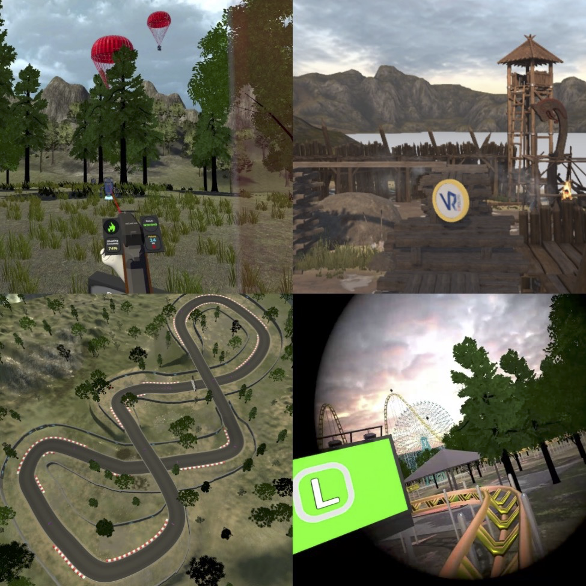

<p align="center">
  
</p>

# Cybersickness Evaluation Testbed VR
The Cybersickness Evaluation Testbed VR (or CET-VR) is a tool which helps to select and evaluate the best suitable cybersickness mitigation technique to adopt in a given VR application scenario.

* [Introduction](#introduction)
* [Videos](#videos)
* [Experimental Material](#experimental-material)
* [Builds and Building](#builds)
* [Tool Usage](#tool-usage)
* [Cybersickness Mitigation Techniques](#cybersickness-mitigation-techniques)
* [Advanced Configuration](#advanced-configuration)
* [Forking Policies](#forking-policies)
* [Citation](#citation)
* [Contacts](#contact)
* [License](#license)
* [Acknowledgements](#acknowledgements)
* [Known Issues](#known-issues)
* [Related Projects by VR@POLITO](#related-projects-by-vrpolito)

## Introduction

COMING SOON

## Videos

Some videos showing tasks execution with and without a openly available mitigation technique (VR Tunnelling Pro) for each scenario are available at this [**Link**](http://tiny.cc/64rdzz)

## Experimental Material

Additional material to support the user-study can be found in the [**Experimental Material/**](Experimental%20Material/)
folder. In particular:

- [**Administrator Script.docx**](Experimental%20Material/Administrator%20Script.docx): Script supporting the test
  administrator in providing information to the participant -> COMING SOON
- [**Questionnaire.docx**](Experimental%20Material/Questionnaire.docx): The full questionnaire

## Builds

The application targets only **Windows 10/11** and can be deployed to any VR system compatible with the **OpenXR** API,
although minimum modifications may be necessary to support non-tested hand controllers

- The builds have been tested with **Meta Quest 2/Pro** (via Link/AirLink)** w/ Touch/Touch Pro controllers and **HTC Vive/Pro** w/ Vive controllers.

### Build *CET-VR*

Instructions to compile the project:

#### Infos

The project was developed and tested using [**Unity 2021.3.x (LTS)**](https://unity3d.com/unity/qa/lts-releases?version=2021.3) and requires the **Windows Build Support (IL2CPP)**, which can be installed through Unity Hub as additional component.

The list of unity package dependencies is in the [**manifest file**](UnityProject/Packages/manifest.json) and will be
automatically managed by the Unity editor. You will need also [**Blender**](https://www.blender.org/download/) to be
installed (v2.8+), to have Unity correctly load the blend files in the project.

Before building, it is also necessary to import a set of free assets available in the Unity Asset Store. To facilitate integration, the corresponding .meta files have been provided. Upon opening the project, Unity will delete the .meta files related to missing files, so when importing the asset, you need to avoid overwriting the corresponding .meta files or restore the original version found in the repository. The list of required assets can be found in the [Acknowledgements](#acknowledgements) section.

**Important**: a Unity account is required to access the Unity Asset Store and to download free assets.

**Note**: After importing the **MS Vehicle System (free version)**, the **Bézier Path Creator**, and the **Viking Village** assets, you need to apply a patch to ensure proper integration. Navigate with a command prompt to the main project directory containing the patch files ([**MSVehicleSystem(FreeVersion)_patch.diff**](MSVehicleSystem(FreeVersion)_patch.diff), [**PathCreator_patch.diff**](PathCreator_patch.diff), and [**VikingVillage_patch.diff**](VikingVillage_patch.diff)), and run the following git commands to apply the necessary modifications:

```bash
git apply MSVehicleSystem_patch.diff
git apply PathCreator_patch.diff
git apply VikingVillage_patch.diff
```

#### Prepare to Build

1. In Unity, open an existing project and select the [**UnityProject/**](UnityProject/) folder
    1. If package errors are reported, press Continue, open the Package Manager (Window -> Package Manager) and try
       updating the involved packages, after that restart the project
1. Scene files for each scenario are placed inside the [**UnityProject/Assets/Scenes/**](UnityProject/Assets/Scenes/)
   folder. Before building, open each scene file and perform the bake of the lighting (Window -> Lighting Tab ->
   Generate Lighting).
    1. NOTE: baking is a computationally intensive task, and the time required for completing it can vary based on the
       hardware. By default, Progressive GPU Lightmapper is selected, switch back to CPU
       in case of low-performance graphics adapters. Also, to pick a specific GPU device to be used for the baking
       please refer to the [**official Unity manual page**](https://docs.unity3d.com/2018.4/Documentation/Manual/GPUProgressiveLightmapper.html)

#### Project Build Instructions

To build the project in Unity, follow these steps (N.B. ensure the necessary scenes are correctly ordered and lighting has been baked for all scenarios):

- **Build for Windows Platform**:
  - Open **Build Settings** from **File** > **Build Settings**.
  - Ensure the **Windows** platform is selected. If not, click **Windows** and then select **Switch Platform**.
  - All the the necessary scenes should be already selected and ordered correctly in the **Scenes in Build** list.

- **Build the Project**:
  - Click **Build** and choose the destination folder for the build files.

## Tool Usage

To use the tool, follow the steps outlined below:

### Main Menu Selection


- Select one of the four available scenarios from the main menu.
- Optionally, choose one of the supported mitigation techniques.

You can interact with the interface using the mouse or via keyboard shortcuts:

- **Keyboard Shortcuts**:
  - Each button has a highlighted letter that corresponds to a selectable key.
  - Toggle left-handed mode by pressing `H`.
  - Increase or decrease the value in the user ID input field using the `+` and `-` keys.
  - Cycle between mitigation techniques and controller configurations using the arrow keys:
    - **Up/Down Arrows**: Cycle through mitigation techniques.
    - **Left/Right Arrows**: Cycle through controller configurations (e.g., for Vive controller select `Trackpad` or Quest controller select `Thumbstick`).

### Scenario Loading

Once the desired scenario is selected and loaded, the user will start in VR at the designated starting point, facing a panel with instructions for the experience.

To begin the experience, follow these steps in order:
1. The experimenter must press `CTRL+I` to arm the start.
2. The user must press one of the controller triggers.
   - Alternatively, the experimenter can force the start by pressing the `SPACE` key.

### Shortcuts Information

All available shortcuts are displayed on the experimenter's monitor interface.
  - The interface can be hidden using `CTRL+H`.
  - **Note**: Shortcuts may vary between different scenarios.


### Discomfort Scale Monitoring
  - Every minute, a highly visible indicator will prompt the experimenter to update the Discomfort Scale value (from 1 to 10) by asking the user how they feel.
  - If the score reaches 10, the simulation will be interrupted automatically (equivalent to using the `CTRL+L` combination for cybersickness withdrawal).
  - Always use `CTRL+L` to terminate the experience in case of extreme cybersickness symptoms (**Important**: Do not use `CTRL+Q`, as it does not ensure an orderly termination of the logging component).

## Cybersickness Mitigation Techniques

The CET-VR testbed includes a variety of cybersickness mitigation techniques from different sources, including the **GingerVR** repository and other well-known works in the literature.

### Integrated Techniques

1. **GingerVR Repository**: 
   - The **GingerVR** repository was integrated to provide numerous cybersickness mitigation techniques that have been proposed in the literature. More details on the techniques provided by GingerVR can be found in the original work [here](https://doi.org/10.1109/VRW50115.2020.00097).
     
     - **SingleNose**: Inspired by the work of [Wienrich et al. (2018)](https://doi.org/10.1109/VS-Games.2018.8493408).
     - **AuthenticNose**: Inspired by [Wienrich et al. (2018)](https://doi.org/10.1109/VS-Games.2018.8493408).
     - **DynamicGaussianBlur**: Inspired by [Budhiraja et al. (2017)](https://doi.org/10.48550/arXiv.1710.02599).
     - **ColorBlur**: Inspired by [Nie et al. (2020)](https://doi.org/10.1109/TVCG.2019.2893668).
     - **DynamicFOV (Field of View)**: Inspired by [Fernandes and Feiner (2016)](https://doi.org/10.1109/3DUI.2016.7460053).
     - **DotEffect**: Inspired by [Buhler et al. (2018)](https://doi.org/10.1109/VR.2018.8446346).
     - **HeadSnapper**: Inspired by [Farmani and Teather (2018)](https://doi.org/10.20380/GI2018.23).
     - **VisionLock**: Inspired by [Kemeny et al. (2017)](https://doi.org/10.2352/ISSN.2470-1173.2017.3.ERVR-097).
     - **VirtualCAVE**: Inspired by [Nguyen-Vo et al. (2018)](https://doi.org/10.1109/VR.2018.8446383).

2. **VR Tunnelling Pro**: 
   - The free **VR Tunnelling Pro** Unity asset was integrated into the testbed. This asset allows for variations and customizations of the original *Dynamic FOV* technique, and, in particular, the *Masked Dynamic FOV* evaluated in the paper. More details can be found [here](http://www.sigtrapgames.com/vrtp/).

3. **Additional Techniques from Literature**:
   - **Circle Effect**: Implemented based on the description provided in [Bühler et al. (2018)](https://doi.org/10.1109/VR.2018.8446346).
   - **Gaze-Contingent Depth-of-Field**: This technique was developed following the paper by [Carnegie and Rhee (2015)](https://doi.org/10.1109/MCG.2015.98).

## Advanced Configuration

COMING SOON

## Forking Policies

Please contact [Davide Calandra](mailto:davide.calandra@polito.it?subject=[GitHub]%20CET-VR) **BEFORE**
forking the Project

## Citation

Please cite this paper in your publications if it helps your research.

    @ARTICLE{cetvr,
    author={Calandra, Davide and Lamberti, Fabrizio},
    journal={IEEE Transactions on Visualization and Computer Graphics}, 
    title={A Testbed for Studying Cybersickness and its Mitigation in Immersive Virtual Reality}, 
    year={2024},
    volume={},
    number={},
    pages={1--18},
    keywords={Prevention and mitigation;Visualization;Measurement;Dynamics;Task analysis;Standards;Taxonomy;cybersickness;testbed;virtual reality;evaluation;virtual environments;simulator sickness;taxonomy},
    doi={10.1109/TVCG.2024.3448203}}

The **CET-VR** design is detailed in:

- *A Testbed for Studying Cybersickness and its Mitigation in Immersive Virtual Reality*
    - [**IEEE TVCG**](https://doi.org/10.1109/TVCG.2024.3448203)

## Contact

Maintained by [Davide Calandra](mailto:davide.calandra@polito.it?subject=[GitHub]%20CET-VR) - feel free
to contact me!

## License

Experimental material and Unity project are licensed under MIT License

## Acknowledgements

The project requires the following repositories and assets:
- [**GingerVR**](https://github.com/angsamuel/GingerVR): A collection of cybersickness mitigation techniques in VR for Unity, modified to work with OpenXR (included, further bug fixes might be required).
- [**VR Tunnelling Pro**](https://github.com/sigtrapgames/VrTunnellingPro-Unity): An asset for reducing cybersickness via visual effects (included).
- **Water4Stereo** (included, original GitHub repo deleted, author info lost. Apologies).
- [**Viking Village**](https://web.archive.org/web/20210302022641/https://assetstore.unity.com/packages/essentials/tutorial-projects/viking-village-29140) (to be imported)
- [**Race Tracks**](https://web.archive.org/web/20220721135823/https://assetstore.unity.com/packages/3d/environments/roadways/race-tracks-140501) (to be imported)
- [**MS Vehicle System (free version)**](https://assetstore.unity.com/packages/tools/physics/ms-vehicle-system-free-version-90214) (to be imported and patched)
- [**Tiny Robot Packs**](https://assetstore.unity.com/packages/3d/characters/robots/tiny-robots-pack-98930) (to be imported)
- [**Bézier Path Creator**](https://assetstore.unity.com/packages/tools/utilities/b-zier-path-creator-136082) (to be imported and patched)
- [**3D Game Effects Pack Free**](https://assetstore.unity.com/packages/vfx/particles/3d-games-effects-pack-free-42285) (to be imported)
- [**World Material Free**](https://assetstore.unity.com/packages/2d/textures-materials/world-materials-free-150182) (to be imported)

## Known Issues

1. **Missing Asset - Race Tracks**: 
   The "Race Tracks" asset was recently removed from the Unity Asset Store, making it unavailable for direct download. We will try reaching out to the original author to request that the asset be made available outside of the Unity Asset Store. In the meantime, as a temporary solution, the necessary asset package, extracted from the complete project, can be downloaded here: [Race Tracks Asset Package](https://mega.nz/file/L0ZkzCbB#XqZJdVO07iyeVDkRWLUr0Z0RdEzSbWIdssnjUcLGKeo). If we are unable to resolve this issue, we will replicate the scenario (i.e., the track used in the testbed) from scratch in the long term.

2. **Viking Village Asset Update**: 
   The "Viking Village" asset was recently updated on the Asset Store to an optimized version compatible with Unity's Universal Render Pipeline (URP). However, our testbed uses an earlier version designed for Unity 5 and the Built-In Render Pipeline. Since the current version is no longer compatible with the Built-In pipeline, we are providing the previous version, also extracted from the full project, as a temporary download here: [Viking Village Previous Version](https://mega.nz/file/T9BXHYRT#UUgR330aLUWNvyxDx_PRkGL8hZQijtET6yKOBF4sILE). In the near future, we plan to update the testbed to be compatible with the latest URP version of the Viking Village asset, available [here](https://assetstore.unity.com/packages/essentials/tutorial-projects/viking-village-urp-29140).

3. **GingerVR Compatibility Adjustments**:
   The **GingerVR** asset was originally designed for Oculus Integration and the older `UnityEngine.XR` framework. It has been modified to ensure compatibility with OpenXR and the new `Unity XR Plugin Management`. However, there are still some unresolved issues, such as:
   - Compatibility with **Single Pass Rendering** mode, which currently might cause unexpected visual behaviors.
   - Proper stereo management for visual techniques applied to the entire frame, resulting in incorrect or inconsistent effects across both eyes in VR.

   Additionally, one of the techniques from GingerVR, the **VirtualCAVE** effect, was missing a crucial component (i.e., the management script). This script had to be recreated from scratch by following the description provided in the original paper to ensure proper functionality.

   The implementation of the **VisionLock** technique was also modified. Previously, it required parenting the entire scene's content to the user’s Camera during activation, which made it incompatible with scenarios involving physics, gravity, or lighting from the skybox. These limitations have been addressed to improve compatibility and functionality within the testbed environment.

## Related Projects by VR@POLITO

Check out other related projects from VR@POLITO:

- [**LET-VR** (Locomotion Evaluation Testbed VR)](https://github.com/VRatPolito/LET-VR/): LET-VR is a research project aimed at supporting a comprehensive comparison of locomotion techniques for immersive VR using a provided evaluation testbed.

<p align="center" width="100%">
     
</p>

